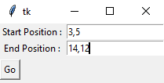
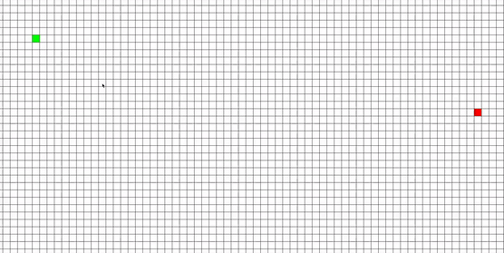
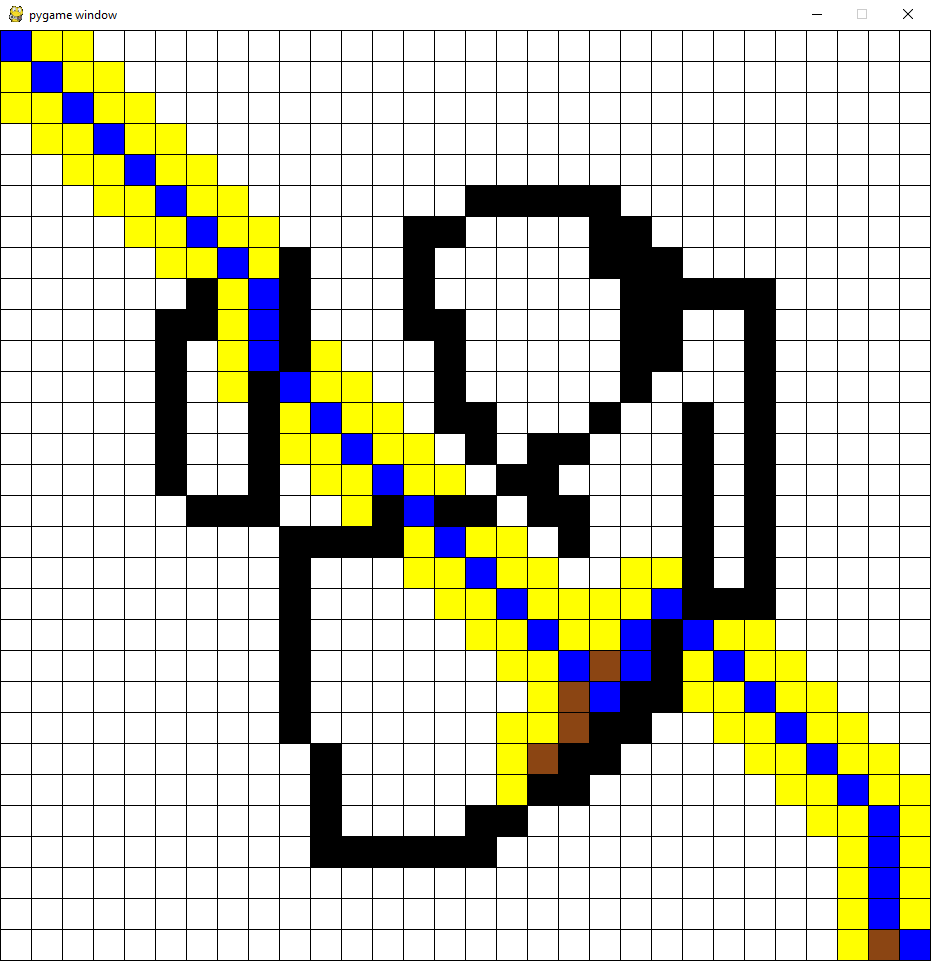

# Astar-Algorithm-Visualized

To install pygame:

```
pip install pygame
```

I visualized A* algorithm with pygame.

I used tkinter for user input. Coordinates should be separated by comma.



User is able to draw obstacles. <br>
Press space button to execute A* Algorithm.




<br><br>
